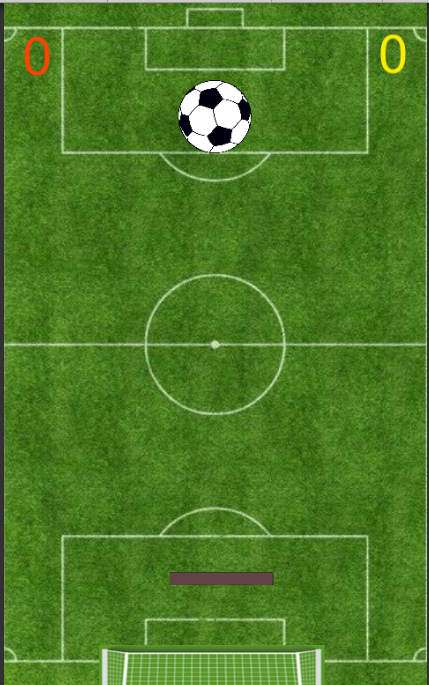
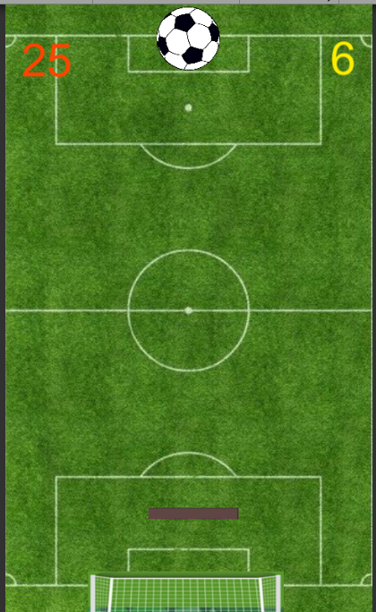
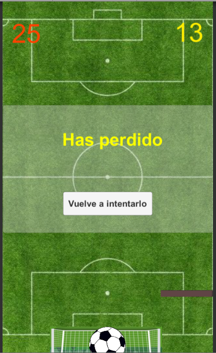

# MinijuegoToques

:ES: 
Pequeño juego realizado con Unity y C#. 

Se trata de una pantalla simple que representa un campo de fútbol donde un balón :soccer: empezará a caer y tendremos que evitar que llegue al extremo del campo mediante una barra que puede moverse a izquierda y derecha.  
En la esquina superior derecha y en amarillo irá mostrándose las veces que hemos parado el balón con la barra.
En la esquina superior izquierda y en naranja se mostrará el actual récord. 
Si el :soccer: logra superar la barrera, aparecerá un mensaje informando al usuario de que ha perdido la partida y si quiere volver a empezar.

:GB: 
Little phone game made with Unity and C#.

This is a simple screen that represents a soccer field where a ball :soccer: will begin to fall and we will have to prevent it from reaching the end of the field by moving a barrier from left to right. 
In the upper right corner and in yellow, the number of times we have stopped the ball with the bar will be displayed.
In the upper left corner and in orange, the current record will be shown. 
If the :soccer: manages to overcome the barrier, a message will appear informing the user that they have lost the game and if they want to start over.

